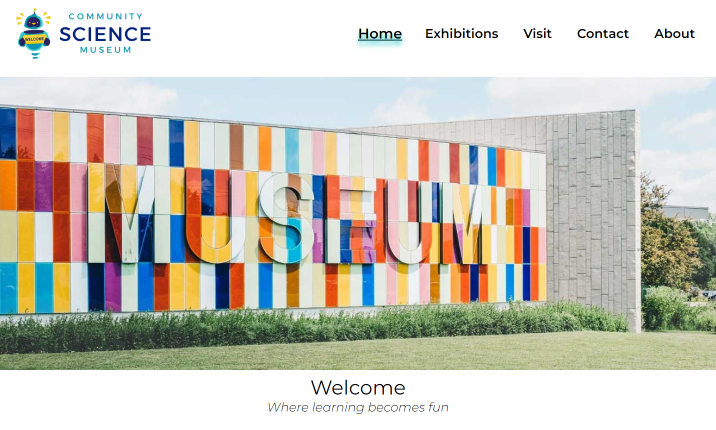

# Semester project 1
Made by Mia Parken Texnes
(https://sciencemuseummia.netlify.app/)

  

First year project to create a interactive Community Science Museum website using what we have learned so far.
I wanted the site to be clean, fun and appealing to a big and eager to learn audience

## The site architecture for my site became the following:
1.	Home – Welcome museum image, and cards with some of the exhibitions
2.	Exhibitions – Showing all the current exhibitions in the museum
3.	About – Explaining page about why and how we want our museum to be
4.	Visit – A page explaining all the practical information of the museum
5.	Contact – How to get in touch with us and see us
6.	Medical – A presentation of our exhibit about the body
7.	Vr – A presentation of our exciting VR area
8.	Kids – A presentation of our Kids corner exhibition

## The site was built with:
- [HTML]
- [CSS]
- [Figma]
- [Balsamique]

## The assignment was to create a functional web site with the following requirements:
1.	The site must have a design that appeals to the target audience.
2.	The site must have at least 4-6 pages.
3.	Compositional principles, typography, and colour schemes must be considered.
4.	Your HTML should be semantic and neatly indented.
5.	The site should use external CSS style sheets which follow the DRY principle.
6.	The site should download quickly and not be overly “heavy”. Images should be at most 200kb.
7.	The site should consider WCAG principles, especially regarding hierarchy, navigation, and colour usage.
8.	The site should be responsive, attractive, and easy to use on various devices.
9.	The site should show consideration for content strategy and SEO (consider your use of meta tags and alt text).

